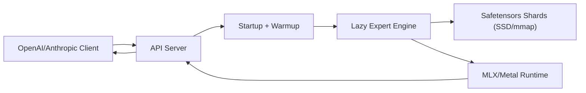
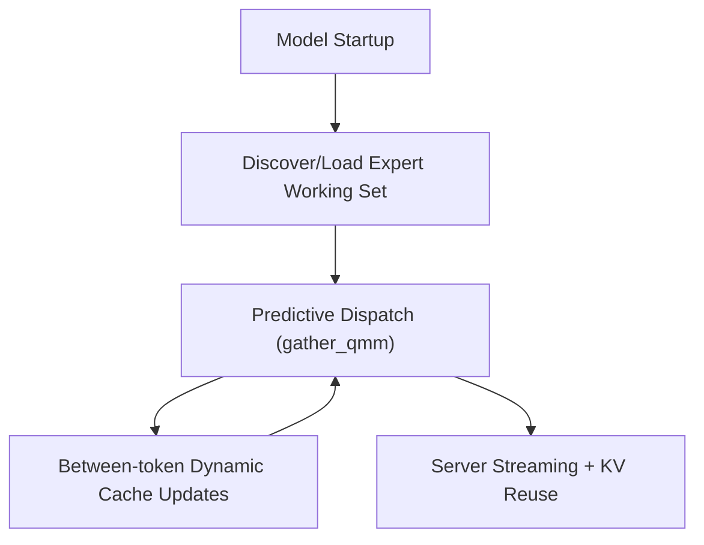

# Architecture Overview

This page is intentionally high-level. Detailed docs are split by subsystem:

- [Startup and Cache Build](startup.md)
- [Generation Runtime and Dynamic Updates](runtime.md)
- [Server and API Flow](server.md)
- [Memory and Capacity Model](memory.md)

## System Diagram

## Core Flows

## Design Invariants

- Forward path stays lazy in predictive modules (no `mx.eval()` in module `__call__`).
- Dynamic cache updates happen between tokens, not inside forward.
- Skip-fallback masking is enabled so misses do not inject wrong-expert outputs.
- Startup chooses one source of truth for expert state: prepacked, saved cache-state, or fresh discovery/profile path.
- Capacity and wiring target Metal working-set limits, not total RAM.
