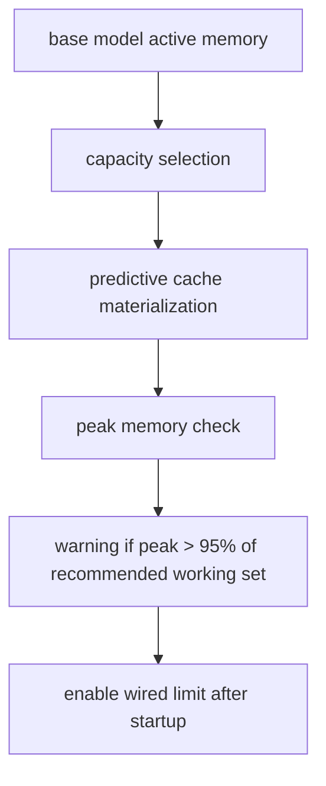
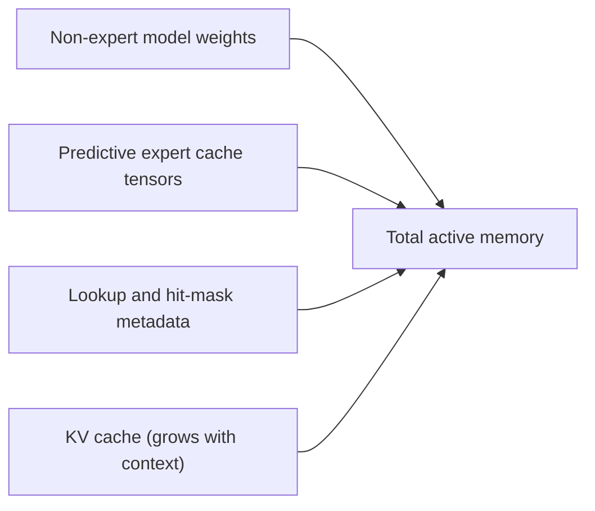

# Memory and Capacity

[Back to Architecture Overview](README.md)

This page covers capacity math, working-set targeting, and runtime memory behavior.

## Capacity Selection

`select_capacity(...)` targets 71% of Metal's recommended working-set size:

```text
target_gb = 0.71 * max_recommended_working_set_size_gb
slot_gb = num_moe_layers * expert_slot_mb / 1024
capacity = floor((target_gb - base_memory_gb) / slot_gb)
```

`expert_slot_mb` includes `weight + scales + biases`.

## Memory Control Flow



## Runtime Memory Buckets



Example at capacity around `208` on a `32 GB` machine:

- non-expert base weights
- predictive expert cache (`capacity x moe_layers`)
- lookup/hit-mask metadata
- KV cache growth during generation

## Wired Memory


Wiring is intentionally applied after expert loading/refinement.

## Loading Strategy Notes

- Fresh `mx.load()` calls in hot paths avoid retaining lazy refs that can keep large source tensors materialized.
- `SafetensorsMap` enables mmap-based expert slicing to avoid loading full stacked tensors when only selected experts are needed.
