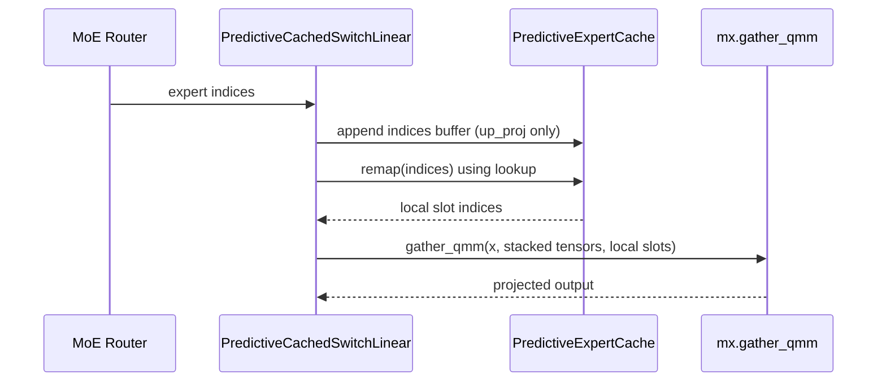
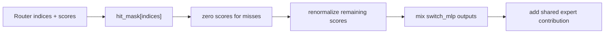
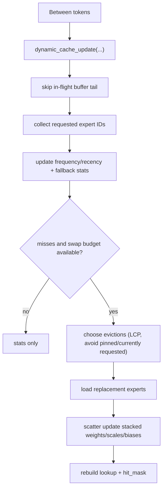
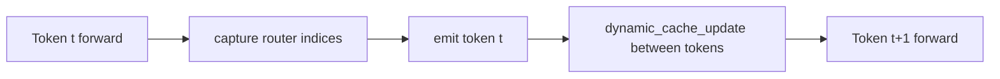

# Runtime Architecture

[Back to Architecture Overview](architecture.md)

This page covers predictive forward dispatch, skip-fallback behavior, and dynamic cache updates.

## Predictive Forward Path

Key invariant: predictive module `__call__` stays lazy and does not call `mx.eval()`.

## Skip-Fallback Path

`enable_skip_fallback(...)` patches MoE block call paths so uncached experts do not route to wrong-expert slot outputs.

## Dynamic Cache Update

Swap control:

- Global per-call limit: `max_layer_updates`.
- Per-layer cap inside cache update path.

## Runtime Loop

