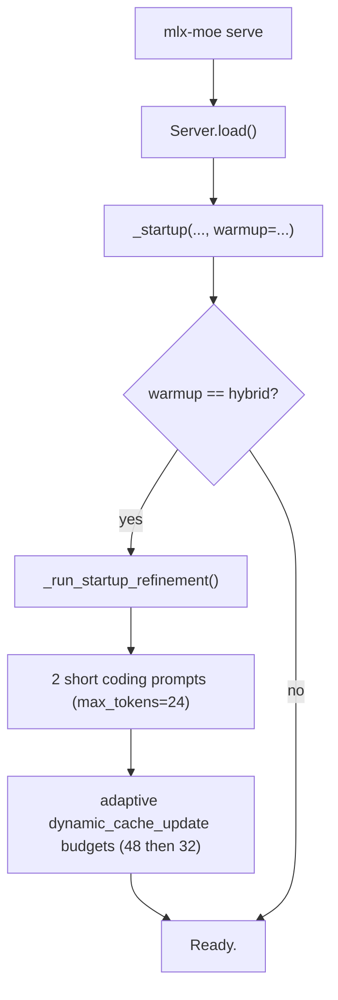
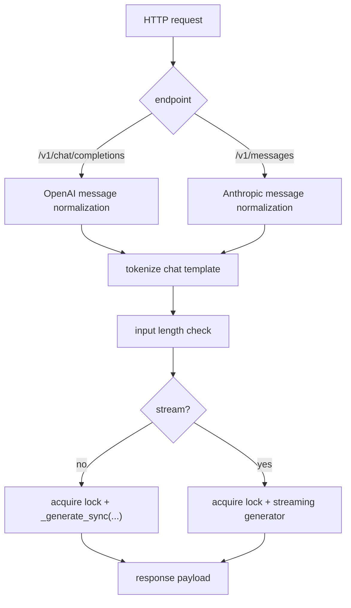
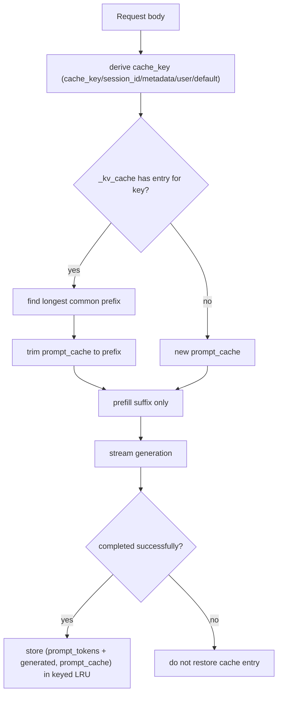
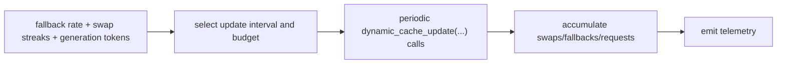

# Server Architecture

[Back to Architecture Overview](README.md)

This page covers `mlx_moe/server.py`: startup/refinement, request execution, KV reuse, and telemetry.

## Boot and Warmup

Hybrid refinement cost is paid before first client request.

## Request Path

## KV Cache Reuse

`_kv_cache` is an LRU `OrderedDict` bounded by `--kv-cache-slots`.

## Dynamic Update Policy During Streaming

Telemetry fields:

- `prefill`
- `ttft`
- `decode tok/s`
- `dcu_calls`
- `swaps`
- `fallback_rate`
