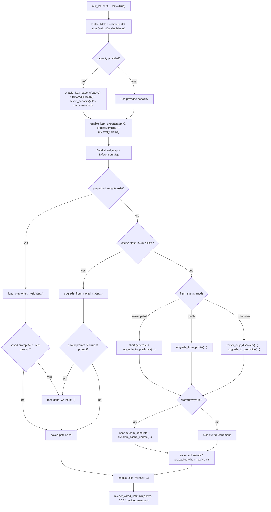
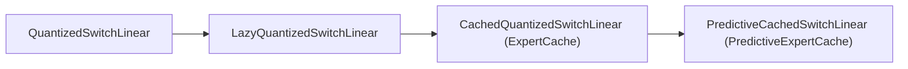
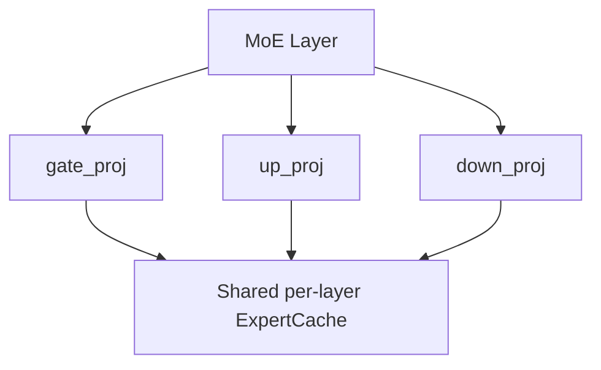
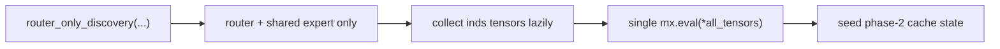
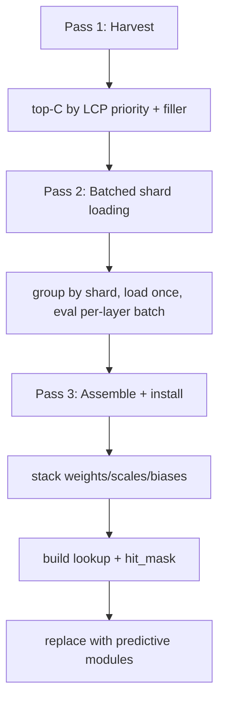
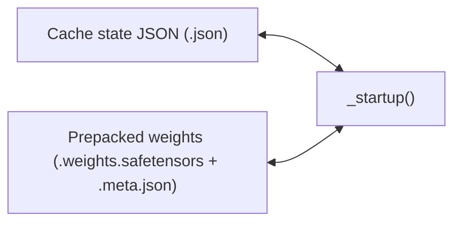

# Startup Architecture

[Back to Architecture Overview](architecture.md)

This page covers `_startup()` and cache materialization flow in `mlx_moe/lazy_experts/generate.py`.

## Startup Goals

- Load lazily and choose a safe capacity.
- Build predictive expert state from the fastest valid source.
- Finalize runtime safety knobs (skip-fallback + wired limit).

## Startup Decision Tree

Key points:

- Persistence precedence is `prepacked -> cache-state -> fresh build`.
- `enable_lazy_experts(..., predictive=True)` installs phase-2 cached modules first; predictive modules are installed by upgrade.
- Fresh path is `full`, `profile`, or `router-only discovery` depending on flags.
- Hybrid refinement runs only on fresh path inside `_startup()`.
- Wiring is always the final startup action when supported.

## Module Replacement

### Supported MoE Paths

- `layer.mlp.switch_mlp`
- `layer.block_sparse_moe.switch_mlp`

### Why the Chain Exists

- `LazyQuantizedSwitchLinear` defers expert tensor loading to on-demand shard access.
- `CachedQuantizedSwitchLinear` introduces per-layer LCP caches shared by `gate_proj`, `up_proj`, and `down_proj`.
- `PredictiveCachedSwitchLinear` removes forward-path sync points by dispatching directly from pre-stacked tensors and a GPU lookup table.

LCP priority in phase-2 caches is:

`priority = frequency * 0.25^(recency / 128)`

## Discovery and Upgrade

### Notes

- `router_only_discovery(...)` collects router indices lazily and bulk-evals once (`mx.eval(*all_tensors)`), then seeds phase-2 cache frequency/recency.
- `upgrade_to_predictive(...)` runs harvest, batched load, and assemble/install passes.
- Uncached IDs map to slot `0`; skip-fallback masking prevents wrong-expert contamination.
- Profile startup in `_startup()` uses `upgrade_from_profile(...)` then predictive upgrade.

Pinning sources:

- `pin_top_k` for exact top-K.
- `pin_threshold` for activation-fraction threshold.

Pinned experts are excluded from eviction during dynamic updates.

## Startup Artifacts

Artifact notes:

- Cache-state JSON restores routing metadata for phase-2 reconstruction.
- Prepacked weights restore phase-3 stacked tensors directly for fastest warm starts.
